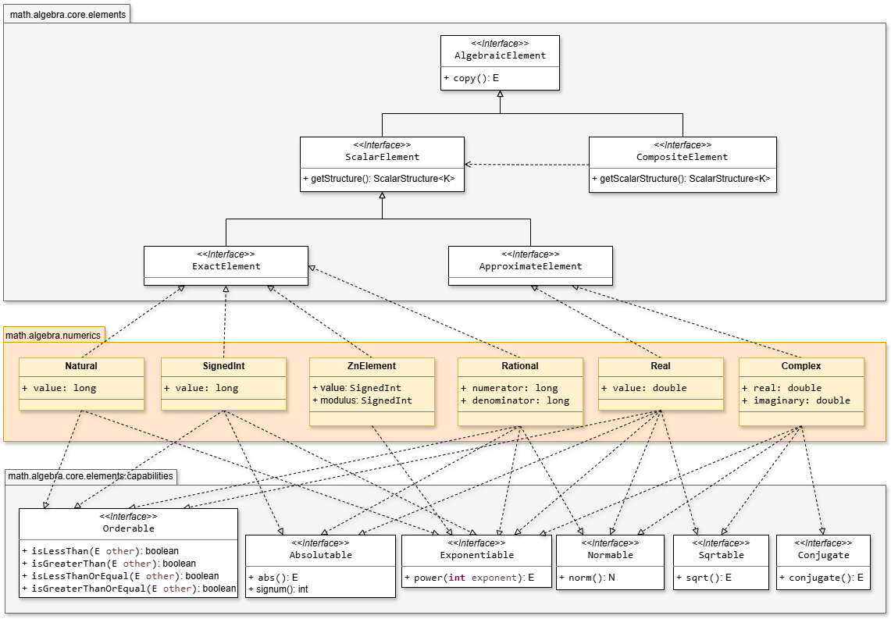
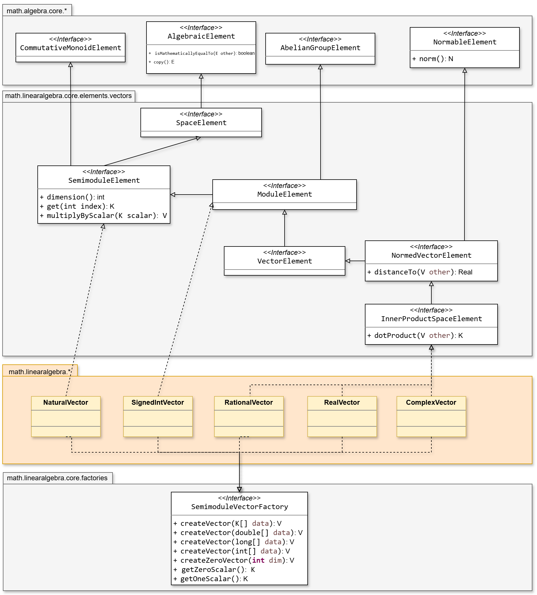
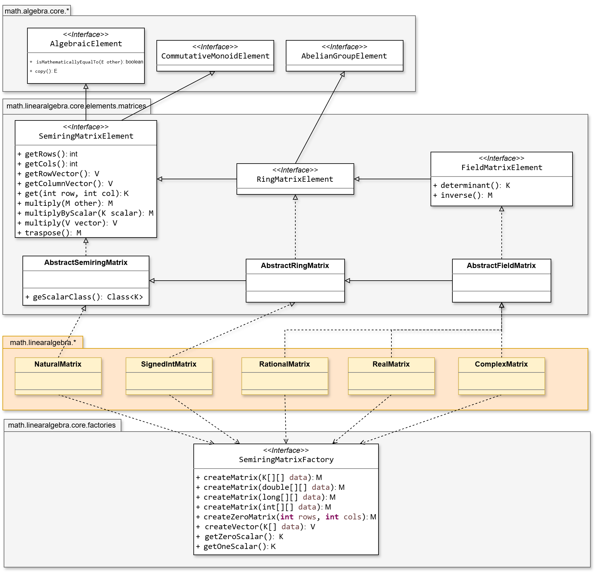

# SMFN-library  
Type: Java Math Library | Status: Continuous Research (Sawdust alert!)

A "slow-burning" Java experimental library for mathematical modelling. It is not designed for performance, but rather to represent abstract mathematical structures and use them to perform symbolic and numerical calculations, making it possible to handle symbolic polynomial arithmetic, solve differential equations or simulate quantum mechanics problems.


## Guida all'Uso

### Elementi e Strutture Algebriche
Gli **elementi** (`Real`, `Complex`, `Polynomial`, `Vector`, `Matrix`) sono oggetti immutabili privi di metodi operativi. Tutte le operazioni algebriche vivono esclusivamente all'interno delle **strutture** (`RealField`, `PolynomialRing`, `VectorSpace`).

```java
RealField R = RealField.INSTANCE;
Real a = new Real(3.0), b = new Real(4.0);

Real c = R.add(a, b);
Real d = R.multiply(a, b);
```



---

#### 1. Numeri, Natura e Capability (`algebra.numerics`)
Gli elementi numerici della libreria si dividono in due categorie fondamentali:

* **Tipi Esatti:** (`Natural`, `SignedInt`, `Rational`, `ZnElement`). L'uguaglianza e le operazioni sono matematicamente esatte e prive di errore di arrotondamento.

* **Tipi Approssimati:** (`Real`, `Complex`). Basati su rappresentazione floating-point (`double`). L'uguaglianza esatta non viene mai usata ed è sostituita dal confronto con tolleranza, per cui due valori $a$ e $b$ sono considerati uguali se $\vert{}a - b\vert{} < \varepsilon$. La costante globale di tolleranza utilizzata da tutto il motore algebrico è definita centralmente in `net.gommagomma.smfn.math.utils.MathConstants`.

Gli elementi implementano interfacce di capacità (`Capability`) che definiscono proprietà e trasformazioni proprie del singolo valore, come confronti (`.isLessThan()`), valori assoluti (`.abs()`) o radici (`.sqrt()`).

| Tipo | Natura | Descrizione | Capability Implementate (Metodi d'istanza) |
|---|---|---|---|
| `Natural` | Esatto | Interi $\ge 0$ | `Orderable`, `Exponentiable` |
| `SignedInt` | Esatto | Interi con segno | `Orderable`, `Absolutable`, `Exponentiable` |
| `Rational` | Esatto | Frazioni esatte | `Orderable`, `Absolutable`, `Exponentiable`, `Normable` |
| `ZnElement` | Esatto | Interi modulo $n$ | — |
| `Real` | Approssimato | Virgola mobile (`double`) | `Orderable`, `Absolutable`, `Exponentiable`, `Sqrtable`, `Normable` |
| `Complex` | Approssimato | Numeri complessi | `Normable`, `Exponentiable`, `Sqrtable`, `Conjugable` |

```java
Real x = new Real(2.5);
Complex z = new Complex(3.0, 4.0);

x.isLessThan(new Real(3.0)); // Orderable
x.abs();                    // Absolutable
x.sqrt();                   // Sqrtable
z.conjugate();              // Conjugable
z.modulus();                // Normable (|z|)
```

---

#### 2. Strutture (`algebra.structures`)
Le strutture definiscono le operazioni matematiche e le regole algebriche valide per un determinato tipo di elemento. Seguono una gerarchia assiomatica rigorosa:

* **`Semiring`**: Definisce le operazioni di base (`add`, `multiply`) e gli elementi neutri (`zero()`, `one()`).
  * **`Ring`**: Aggiunge l'opposto additivo (`negate`) e la sottrazione (`subtract`).
    * **`CommutativeRing`**: Garantisce la commutatività della moltiplicazione (stessa API di `Ring`, garanzia semantica).
      * **`Field`**: Aggiunge l'inverso moltiplicativo (`inverse`) e la divisione (`divide`).
        * **`EuclideanDomain`**: Aggiunge la divisione con resto (`quotient`, `remainder`) e gli algoritmi di `gcd` e `lcm`.


Poiché un elemento non possiede logica algebrica propria, **è la struttura a definire cosa significano "0" e "1"** in quel determinato contesto:

* **`zero()`**: L'elemento neutro dell'addizione ($x + 0 = x$). A seconda della struttura, rappresenta lo zero numerico (`0.0`), il polinomio nullo, il vettore nullo o la matrice nulla $0_{n \times n}$.

* **`one()`**: L'elemento neutro della moltiplicazione ($x \cdot 1 = x$). Rappresenta l'unità scalare (`1.0`), il polinomio costante $1$ o la matrice identità $I_n$.

Questi metodi sono fondamentali per la scrittura di **algoritmi generici**: permettono a solutori e accumulatori di inizializzare somme, prodotti o condizioni di arresto senza conoscere la natura concreta degli elementi trattati.

Le strutture si dividono in istanze esatte (singleton o parametrizzate) e approssimate:

* `NaturalSemiring.INSTANCE` ($\mathbb{N}$) - Struttura esatta (nessuna sottrazione/divisione).
* `IntegerRing.INSTANCE` ($\mathbb{Z}$) - Struttura esatta.
* `RationalField.INSTANCE` ($\mathbb{Q}$) - Struttura esatta (frazioni ridotte ai minimi termini).
* `RealField.INSTANCE` ($\mathbb{R}$), `ComplexField.INSTANCE` ($\mathbb{C}$) - Strutture approssimate basate su `MathConstants.EPSILON`.
* `new ZnRing(n)` - Anello $\mathbb{Z}/n\mathbb{Z}$ (istanziato in base al modulo $n$).

Nelle strutture approssimate, i metodi di confronto e di azzeramento integrano la tolleranza globale $\varepsilon$:
* **`areEqual(a, b)`**: Restituisce `true` se la distanza tra $a$ e $b$ è inferiore a `EPSILON`.
* **`isZero(x)`**: Restituisce `true` se la norma/valore assoluto di $x$ è inferiore a `EPSILON`.

```java
RealField R = RealField.INSTANCE;

// Accesso agli elementi neutri della struttura
Real zero = R.zero(); // Real con valore 0.0
Real one  = R.one();  // Real con valore 1.0

// Operazioni definite sulla struttura
Real a = R.of(6.0), b = R.of(2.0);
Real sum = R.add(a, b);    // 8.0
Real div = R.divide(a, b); // 3.0 (Richiede che la struttura sia un Field)

// Valutazioni con tolleranza (MathConstants.EPSILON = 1e-12)
boolean isNull = R.isZero(R.of(1E-15));  // true (|x| < MathConstants.EPSILON)
boolean equals = R.areEqual(a, R.of(6.0000000000001)); // true

// Algebra modulare Zn Ring
ZnRing Z5 = ZnRing.of(Z.of(5));
ZnElement a = Z5.getElement(new SignedInt(17)); // a = [17] mod 5 = [2]
ZnElement b = Z5.getElement(new SignedInt(4)); // b = [4] mod 5 = [4]

ZnElement c = Z5.multiply(a, b); // Calcolo: [2] * [4] = [8] mod 5 = [3]
ZnElement d = Z5.add(b, b); // Calcolo: [4] + [4] = [8] mod 5 = [3]
```

---

#### 3. Polinomi (`algebra.polynomial`)
Un `Polynomial<K>` è una struttura dati immutabile che modella unicamente la sequenza ordinata dei coefficienti ($a_0, a_1, .. , a_n$). Come gli elementi numerici è privo di metodi operativi: l'aritmetica, la divisione e la valutazione sono interamente delegate alla struttura algebrica associata, derivata dinamicamente tramite  `PolynomialStructureFactory`.

Il livello algebrico dello scalare $K$ determina la classe della struttura e le operazioni matematiche disponibili:
| Struttura dello Scalare $K$ | Struttura Polinomiale Generata | Operazioni e Capacità Sbloccate |
|---|---|---|
| `Semiring` | `PolynomialSemiring<K>` | Somma (`add`), moltiplicazione (`multiply`), prodotto per scalare. |
| `Ring` | `PolynomialRing<K>` | Opposto (`negate`), sottrazione (`subtract`). |
| `CommutativeRing` | `CommutativePolynomialRing<K>` | Garanzia di commutatività della moltiplicazione polinomiale. |
| `Field` | `EuclideanPolynomialRing<K>` | Divisione euclidea (`divide`, `quotient`, `remainder`), $GCD$ e $LCM$. |

```java
RealField R = RealField.INSTANCE;

// P(x) = 3x^2 - 5x - 2 (coefficienti dal grado 0 al più alto)
Polynomial<Real> p = PolynomialElementFactory.of(R, R.of(-2), R.of(-5), R.of(3));
p.degree();             // 2
p.getCoefficient(1);    // 5.0

// Ottenimento automatico della struttura corretta
ScalarStructure<Polynomial<Real>> polyStructure = PolynomialStructureFactory.getStructureFor(R);
// Field  → EuclideanPolynomialRing  (ha anche quotient/remainder/gcd)
// Ring   → CommutativePolynomialRing o PolynomialRing, a seconda che K commuti
// Semiring → PolynomialSemiring
```

##### Operazioni e Solutori

```java
// Operazioni Standard
PolynomialRing<Real, RealField> ring = new PolynomialRing<>(R);
Polynomial<Real> sum = ring.add(p, q);
Polynomial<Real> product = ring.multiply(p, q);

// Divisione Euclidea (richiede che K sia un Field)
EuclideanPolynomialRing<Real, RealField> euclid = new EuclideanPolynomialRing<>(R);
PolynomialDivisionResult<Real> res = euclid.divide(p, q);

// Divisione per coefficienti non-commutativi (es. Matrici Quadrate)
PolynomialDivisionProvider<SquareMatrix<Complex>, SquareMatrixAlgebra<Complex, ComplexField>> divProvider = 
    new PolynomialDivisionProvider<>(matrixAlgebra);

// Valutazione P(x) in un punto con una strategia di valutazione (HornerEvaluator)
HornerEvaluator<Real, PolynomialFunction<Real, RealField RealField,>> horner = new HornerEvaluator<>(R);
PolynomialFunction<Real, RealField> f = new PolynomialFunction<>(p, R, horner);
Real y = f.apply(R.of(2.0)); // P(2.0)

// Derivata e integrale simbolici
PolynomialDifferentiationProvider<Real, RealField> diff = new PolynomialDifferentiationProvider<>(R);
Polynomial<Real> pPrime = diff.derivative(p);

PolynomialIntegrationProvider<Real, RealField> integ = new PolynomialIntegrationProvider<>(R);
Polynomial<Real> integral = integ.integrate(p, R.zero());  // costante di integrazione esplicita

// Trovare tutte le radici (Newton-Raphson + deflazione, esatta su un campo algebricamente chiuso come Complex)
ComplexField C = ComplexField.INSTANCE;
MetricSpace<Complex> space = (a, b) -> new Real(C.subtract(a, b).modulus());
PolynomialRootSolver<Complex, ComplexField> rootSolver = new PolynomialRootSolver<>(
    C, new Complex(1e-6, 0), space, new Complex(0.4, 0.9), new ConvergenceParameters(new Real(1e-10), 100));

List<Complex> roots = rootSolver.findAllRoots(polynomial);
```

---

#### 4. Spazi, Vettori e Matrici (`linearalgebra`)
Tutte le strutture composite trasversali implementano `LinearElement<V, K>` e si articolano secondo le garanzie algebriche dello scalare $K$ e delle metriche definite sullo spazio.


##### Spazi Vettoriali e Moduli (`Vector<K>`)
Le strutture che gestiscono vettori riflettono la gerarchia assiomatica dei moduli e degli spazi metrici:

| Struttura dello Spazio | Requisiti su $K$ / Spazio | Operazioni Sbloccate |
|---|---|---|
| `Semimodule` | $K \in \text{Semiring}$ | Somma vettoriale (`add`), scaling per scalare positivo (`scale`). |
| `Module` | $K \in \text{Ring}$ | Vettore opposto (`negate`), sottrazione vettoriale (`subtract`). |
| `LinearSpace` (Vector Space) | $K \in \text{Field}$ | Divisione per scalare, basi, dimensione, combinazioni lineari generiche. |
| `NormedSpace` | $K \in \text{Field}$ + Norma | Calcolo della lunghezza/norma (`norm()`), distanza tra vettori. |
| `InnerProductSpace` | $K \in \text{Field}$ + Prod. Interno | Prodotto scalare / Hermitiano (`innerProduct()`), ortogonalità, proiezioni. |



```java
RealField R = RealField.INSTANCE;
VectorSpace<Real, RealField> V3 = new VectorSpace<>(R, 3);

Vector<Real> v = V3.of(R.of(1), R.of(2), R.of(3));
Vector<Real> scaled = V3.scale(R.of(2.0), v);

// Prodotto scalare Hermitiano (coniuga il primo argomento su Complex) e norma
//   su Real (che non implementa Conjugable) la coniugazione è automaticamente l'identità
InnerProductVectorSpace<Complex, ComplexField> ipC = new InnerProductVectorSpace<>(ComplexField.INSTANCE, 2);
Complex dot = ipC.innerProduct(v1, v2); 
Real norm = ipC.norm(a);
```

##### Matrici (`Matrix<K>` e `SquareMatrix<K>`)
Stessa gerarchia dei vettori (`MatrixSemimodule` → `MatrixModule` → `MatrixSpace` → `InnerProductMatrixSpace`).
Le matrici si dividono in due famiglie strutturali in base alla forma e alle proprietà algebriche disponibili:

| Struttura / Classe | Forma | Operazioni e Algoritmi Sbloccati |
|---|---|---|
| **`MatrixSpace`** (`Matrix<K>`) | Rettangolare $m \times n$ | Somma tra matrici, prodotto per scalare, applicazione a un vettore come trasformazione lineare ($A \cdot x$). |
| **`SquareMatrixAlgebra`** (`SquareMatrix<K>`) | Quadrata $n \times n$ | Prodotto matriciale ($A \cdot B$), potenze $A^k$, traccia, determinante (Gauss $O(n^3)$ su `Field`, Laplace $O(n!)$ su `Ring`), inversione (`inverse()`). |



```java
// Matrici rettangolari
MatrixSpace<Real, RealField> M23 = new MatrixSpace<>(R, 2, 3);
Matrix<Real> A = M23.of(new Real[] { new Real(1),new Real(0),new Real(2), new Real(0),new Real(1),new Real(-1) });

M23.transpose(A);
M23.rank(A);

// Matrici quadrate
SquareMatrixAlgebra<Complex, ComplexField> M2 = new SquareMatrixAlgebra<>(ComplexField.INSTANCE, 2);
ScalarStructure<SquareMatrix<K>> structure = SquareMatrixStructureFactory.getStructureFor(scalarStructure, n);
// Field  → SquareMatrixAlgebra   (Gauss per il determinante se n>3, InvertibleElements, LinearSpace — MAI Field!)
// Ring   → SquareMatrixRing      (Laplace per il determinante, funziona su qualunque anello)
// Semiring → SquareMatrixSemiring

// Determinante (Gauss O(n^3) per Field; Laplace O(n!) per Ring generici)
Complex det = M2.determinant(A);
squareMatrixRing.determinant(m);      // Laplace, O(n!), funziona su qualunque Ring (anche Polynomial<Rational>)
squareMatrixAlgebra.determinant(m);   // Gauss, O(n^3), solo se K è un Field — più veloce per n>3

// Inversione (gestita tramite interfaccia InvertibleElements)
if (M2.isInvertible(A)) {
    SquareMatrix<Complex> inv = M2.inverse(A);
}

// Una matrice quadrata non è commutativa (n≥2) e non tutte le matrici non nulle sono invertibili
SquareMatrixAlgebra<Complex, ComplexField> M2 = new SquareMatrixAlgebra<>(ComplexField.INSTANCE, 2);
M2.isInvertible(matrix);       // verifica caso per caso, via determinante
SquareMatrix<Complex> inv = M2.inverse(matrix);   // lancia ArithmeticException se singolare

// Matrici hermitiane
matrix.conjugateTranspose();   // trasposta coniugata (identità su Real, coniuga su Complex)
matrix.isHermitian();          // matrix == matrix.conjugateTranspose(), con tolleranza epsilon
```

`Matrix<K>` **è anche una `VectorFunction<K>`** (`Mapping<Vector<K>,Vector<K>>`): si applica direttamente a un vettore, prodotto matrice-vettore, anche se rettangolare (`m×n`, con `m≠n`):

```java
Vector<Real> result = A.apply(x);   // A*x
```

`SquareMatrix<K>` **è anche un `LinearOperator<Vector<K>>`**: applicarla a un vettore è il prodotto matrice-vettore, `compose()` coincide con il prodotto tra matrici, `power(n)` con la potenza di matrice — tutto ereditato gratis da `Mapping`/`Operator`:

```java
Vector<K> y = squareMatrix.apply(x);
Mapping<Vector<K>,Vector<K>> combined = m1.compose(m2);   // = m1 applicata a (m2 applicata a x)
Operator<Vector<K>> cubed = squareMatrix.power(3);
```
