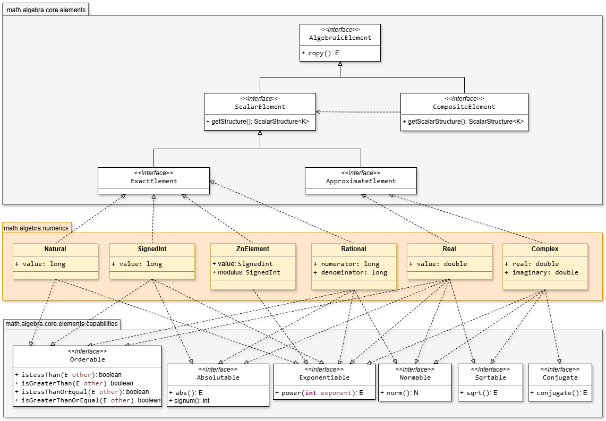
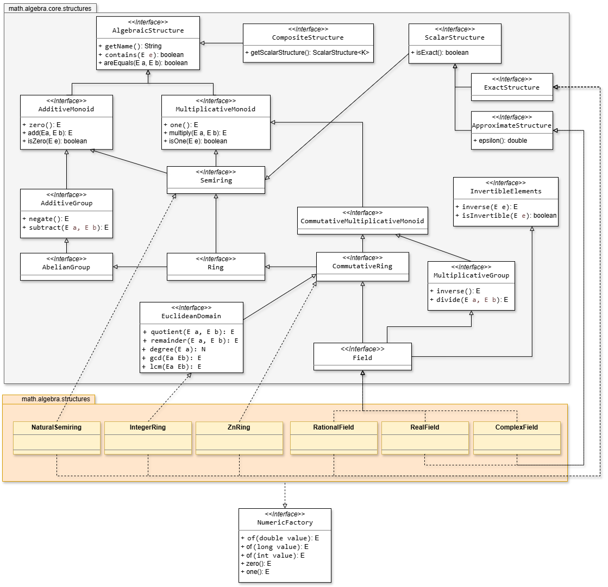

# Part 2: Algebra & Numeric Systems

This section details the algebraic foundations of the **SMFN** framework, covering the taxonomy of elements, capability interfaces, the axiomatic hierarchy of algebraic structures, dynamic polynomial mechanics, and functional mappings.


## Element Architecture
The library defines a clean separation between data-carrying value objects and operational domain logic. All mathematical elements are immutable containers derived from a common root interface.



### Core Abstractions
* **`AlgebraicElement`**: Top-level interface defining state immutability and deep-copy semantics via `copy()`.
* **`ScalarElement`**: Represents single-value scalar entities bound to a governing `ScalarStructure<K>`.
* **`CompositeElement`**: Represents structured multidimensional objects (`Vector`, `Matrix`, `Polynomial`) parameterized over scalar components.
* **`ExactElement` vs. `ApproximateElement`**: Primary taxonomic split separating exact discrete domains from floating-point numerical domains.

### Capabilities
Properties specific to individual elements (e.g., order relations, sign extraction, or norms) are implemented as independent interface traits (Capability) attached directly to element types:

* **`Orderable`**: Exposes relational comparison methods (`isLessThan`, `isGreaterThan`, `isLessThanOrEqual`, `isGreaterThanOrEqual`).
* **`Absolutable`**: Exposes `abs(): E` and `signum(): int`.
* **`Exponentiable`**: Exposes power operations via `power(int exponent): E`.
* **`Normable`**: Exposes vector/scalar norm evaluation via `norm(): N`.
* **`Sqrtable`**: Exposes principal square root extraction via `sqrt(): E`.
* **`Conjugable`**: Exposes complex conjugation via `conjugate(): E`.

### Scalar Numeric Classes
Concrete scalar types located in `math.algebra.numerics` implement fine-grained capability traits defined in `math.algebra.core.elements.capabilities`. This decouple feature contracts from class hierarchies.

| Type | Nature | Fields / Internal State | Implemented Capability Interfaces (Instance Methods) |
| :--- | :--- | :--- | :--- |
| `Natural` | Exact | `value: long` ($\ge 0$) | `Orderable`, `Exponentiable` |
| `SignedInt` | Exact | `value: long` | `Orderable`, `Absolutable`, `Exponentiable` |
| `ZnElement` | Exact | `value: SignedInt`, `modulus: SignedInt` | — |
| `Rational` | Exact | `numerator: long`, `denominator: long` | `Orderable`, `Absolutable`, `Exponentiable`, `Normable` |
| `Real` | Approximate | `value: double` | `Orderable`, `Absolutable`, `Exponentiable`, `Sqrtable`, `Normable` |
| `Complex` | Approximate | `real: double`, `imaginary: double` | `Normable`, `Exponentiable`, `Sqrtable`, `Conjugable` |

```java
Real x = new Real(2.5);
Complex z = new Complex(3.0, 4.0);

// Direct execution of capability contracts
boolean ordered = x.isLessThan(new Real(3.0)); // Orderable
Real absolute   = x.abs();                     // Absolutable
Real root       = x.sqrt();                    // Sqrtable
Complex conj    = z.conjugate();               // Conjugable
Real modulus    = z.norm();                    // Normable (|z|)
```

### Precision & Global Tolerance ($\varepsilon$)
For approximate domains (`Real`, `Complex`), direct identity evaluation (`==`) is forbidden. Equivalence and zero checks are threshold-evaluated using the global constant `MathConstants.EPSILON` ($\approx 10^{-12}$):

$$\vert{}a - b\vert{} < \varepsilon$$

```java
RealField R = RealField.INSTANCE;

// Zero evaluation within global tolerance threshold
boolean isNull = R.isZero(R.of(1E-15));                    // true (|x| < EPSILON)
boolean equals = R.areEqual(R.of(6.0), R.of(6.0000000000001)); // true
```


## Axiomatic Structure Hierarchy & Factories
Operations, operational identities, and mathematical laws reside strictly inside implementations of `math.algebra.core.structures`.



### Structural Axiom Hierarchy
* **`Semiring`**: Combines `AdditiveMonoid` and `MultiplicativeMonoid`. Supplies `zero()` and `one()`.
* **`Ring`**: Extends `Semiring` with `AdditiveGroup` capabilities (`negate`, `subtract`).
* **`CommutativeRing`**: Adds commutative guarantees on multiplication.
* **`EuclideanDomain`**: Extends `CommutativeRing` with division algorithms (`quotient`, `remainder`, `degree`, `gcd`, `lcm`).
* **`Field`**: Extends `CommutativeRing` and `MultiplicativeGroup` with multiplicative inverses (`inverse`, `divide`).

### Contextual Neutral Elements (`zero()` and `one()`)
Identities are contextual to the structure. They allow algorithms to instantiate zero/one values generically without knowing the underlying element implementation:

* **`zero()`**: Neutral element of addition ($x + 0 = x$). Maps to `0.0` in `RealField`, the zero polynomial in `PolynomialRing`, or $0_{n \times n}$ in `SquareMatrixRing`.
* **`one()`**: Neutral element of multiplication ($x \cdot 1 = x$). Maps to `1.0` in `RealField`, the constant polynomial $1$, or the identity matrix $I_n$.


### Usage Examples
```java
// Natural: a Semiring only -- no subtraction, no negative numbers
NaturalSemiring N = NaturalSemiring.INSTANCE;
Natural five = new Natural(5);
Natural three = new Natural(3);

Natural sum = N.add(five, three);          // 8
Natural product = N.multiply(five, three); // 15
Natural power = five.power(3);             // 125 -- a direct capability, no structure needed
```

```java
// SignedInt: a Ring with exact Euclidean division
IntegerRing Z = IntegerRing.INSTANCE;
SignedInt a = new SignedInt(-17);
SignedInt b = new SignedInt(5);

SignedInt quotient = Z.quotient(a, b);   // -4  (-17 = -4*5 + 3)
SignedInt remainder = Z.remainder(a, b); // 3, always non-negative by convention
SignedInt absoluteValue = a.abs();       // 17 -- direct capability
```

```java
// Rational: exact arithmetic, always kept in lowest terms
RationalField Q = RationalField.INSTANCE;
Rational half = new Rational(1, 2);
Rational third = new Rational(1, 3);

Rational sum = Q.add(half, third);         // 5/6, reduced automatically
Rational reciprocal = Q.inverse(third);    // 3
boolean isLess = third.isLessThan(half);   // true -- direct capability, no structure needed
```

```java
// Real: approximate arithmetic (double), with epsilon-tolerant comparison
RealField R = RealField.INSTANCE;
Real two = new Real(2.0);

Real sqrtTwo = two.sqrt();                                       // 1.4142135623730951, direct capability
boolean squaresBack = R.areEqual(R.multiply(sqrtTwo, sqrtTwo), two); // true, within epsilon
```

```java
// Complex: approximate arithmetic, with capabilities that have no real-number equivalent
ComplexField C = ComplexField.INSTANCE;
Complex z = new Complex(3.0, 4.0);

Real modulus = z.norm();          // 5.0 -- |z|
Complex conjugate = z.conjugate(); // 3.0 - 4.0i
Complex zSquared = z.power(2);     // -7.0 + 24.0i
```

```java
// Modular Integer Ring Execution (ZnRing)
ZnRing Z5 = ZnRing.of(new SignedInt(5));
ZnElement a = Z5.getElement(new SignedInt(17)); // [17] mod 5 = [2]
ZnElement b = Z5.getElement(new SignedInt(4));  // [4] mod 5 = [4]

ZnElement c = Z5.multiply(a, b); // [2] * [4] = [8] mod 5 = [3]
ZnElement d = Z5.add(b, b);      // [4] + [4] = [8] mod 5 = [3]
```


## Polynomials
A `Polynomial<K>` is an immutable container encapsulating an ordered list of coefficients $(a_0, a_1, \dots, a_n)$. Operations on polynomials are dispatched to a dynamically resolved structure provided by `PolynomialStructureFactory`.

### Dynamic Capability Elevation Matrix
| Coefficient Structure ($K$) | Generated Polynomial Structure | Unlocked Capabilities |
| :--- | :--- | :--- |
| `Semiring` | `PolynomialSemiring<K>` | Addition (`add`), multiplication (`multiply`), scalar multiplication. |
| `Ring` | `PolynomialRing<K>` | Additive inverses (`negate`), subtraction (`subtract`). |
| `CommutativeRing` | `CommutativePolynomialRing<K>` | Commutative polynomial multiplication. |
| `Field` | `EuclideanPolynomialRing<K>` | Euclidean division (`quotient`, `remainder`), GCD, and LCM. |

```java
RealField R = RealField.INSTANCE;

// P(x) = 3x^2 - 5x - 2
Polynomial<Real> p = PolynomialElementFactory.of(R, R.of(-2), R.of(-5), R.of(3));

// Dynamic structure resolution based on coefficient domain
ScalarStructure<Polynomial<Real>> polyStructure = PolynomialStructureFactory.getStructureFor(R);
// Yields EuclideanPolynomialRing<Real, RealField>
```

### Evaluation, Symbolic Calculus & Solvers
```java
// Evaluation using Horner Scheme
HornerEvaluator<Real, RealField, PolynomialFunction<Real, RealField>> horner = new HornerEvaluator<>(R);
PolynomialFunction<Real, RealField> f = new PolynomialFunction<>(p, R, horner);
Real y = f.apply(R.of(2.0)); // P(2.0)

// Symbolic Differentiation and Integration
PolynomialDifferentiationProvider<Real, RealField> diff = new PolynomialDifferentiationProvider<>(R);
Polynomial<Real> derivative = diff.derivative(p);

PolynomialIntegrationProvider<Real, RealField> integ = new PolynomialIntegrationProvider<>(R);
Polynomial<Real> integral = integ.integrate(p, R.zero());

// Root Extraction over Complex Field
ComplexField C = ComplexField.INSTANCE;
MetricSpace<Complex> space = (a, b) -> new Real(C.subtract(a, b).modulus());
PolynomialRootSolver<Complex, ComplexField> rootSolver = new PolynomialRootSolver<>(
    C, new Complex(1e-6, 0), space, new Complex(0.4, 0.9), 
    new ConvergenceParameters(new Real(1e-10), 100)
);

List<Complex> roots = rootSolver.findAllRoots(complexPolynomial);
```

## Functional Mappings & Linear Operators
SMFN models transformations through an explicit functional interface hierarchy ($f: I \to O$).

### Hierarchy Overview
* **`Mapping<I, O>`**: Base interface for functional transformations. Exposes `O apply(I input)` and composition via `compose(Mapping)`.
* **`Operator<T>`**: Specializes `Mapping<T, T>` to endomorphisms. Enables repeated application and powers (`power(int n)`).
* **`LinearOperator<T>`**: Refines endomorphisms over vector spaces. Implemented directly by matrix structures like `SquareMatrix<K>`.

```java
SquareMatrix<Real> rotation = ...; // Linear Operator
Vector<Real> v = ...;

// Operator Composition and Power Application
Vector<Real> doubleRotated = rotation.compose(rotation).apply(v);
Vector<Real> fullTurn      = rotation.power(4).apply(v);
```