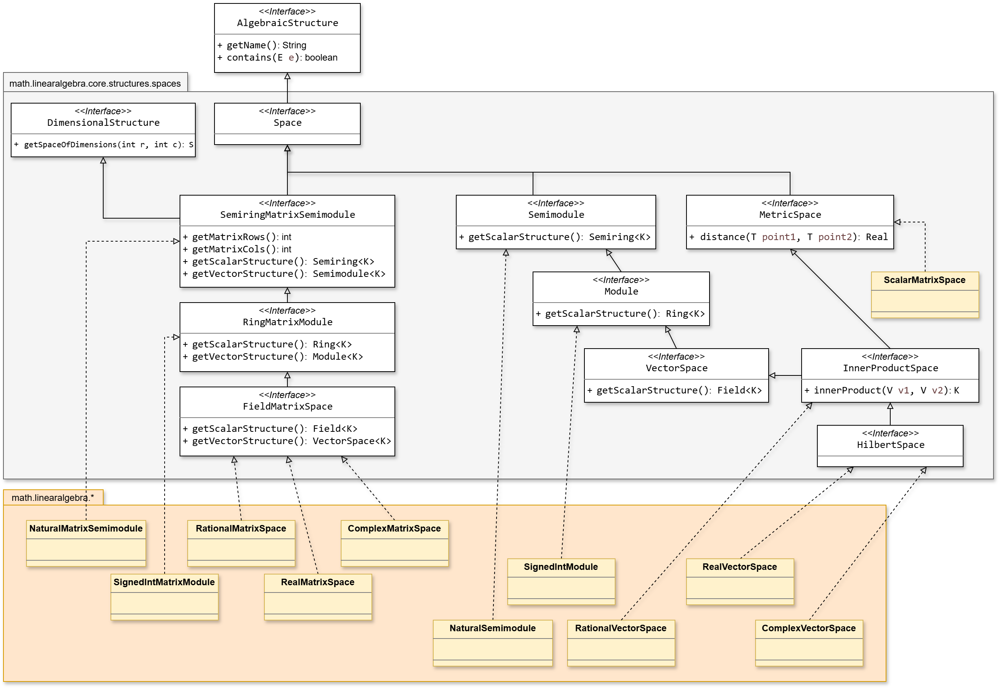

# Part 3: Linear Algebra

## Spaces
Le strutture che gestiscono vettori e matrici riflettono la gerarchia assiomatica dei moduli e degli spazi metrici:



| Struttura dello Spazio | Requisiti su $K$ / Spazio | Operazioni Sbloccate |
|---|---|---|
| `Semimodule` | $K \in \text{Semiring}$ | Somma vettoriale (`add`), scaling per scalare positivo (`scale`). |
| `Module` | $K \in \text{Ring}$ | Vettore opposto (`negate`), sottrazione vettoriale (`subtract`). |
| `LinearSpace` (Vector Space) | $K \in \text{Field}$ | Divisione per scalare, basi, dimensione, combinazioni lineari generiche. |
| `NormedSpace` | $K \in \text{Field}$ + Norma | Calcolo della lunghezza/norma (`norm()`), distanza tra vettori. |
| `InnerProductSpace` | $K \in \text{Field}$ + Prod. Interno | Prodotto scalare / Hermitiano (`innerProduct()`), ortogonalità, proiezioni. |


## Vectors
`Vector<K>` is an immutable, fixed-size sequence of `K` elements. As numerical elements, all operations reside in a structure (VectorSpace) built for a specific dimension.

```java
RealField R = RealField.INSTANCE;
VectorSpace<Real, RealField> V3 = new VectorSpace<>(R, 3);

Vector<Real> v = V3.of(new Real[]{ R.of(1.0), R.of(2.0), R.of(3.0) });
Vector<Real> w = V3.of(new Real[]{ R.of(4.0), R.of(-1.0), R.of(2.0) });

Vector<Real> sum = V3.add(v, w);          // (5.0, 1.0, 5.0)
Vector<Real> scaled = V3.scale(R.of(2.0), v); // (2.0, 4.0, 6.0)
```


The structure available depends on what `K` guarantees:

| Structure | Requires `K` to be | Adds |
|---|---|---|
| `VectorSemimodule<K,S>` | `Semiring` | `add`, `scale`, `zero()` |
| `VectorModule<K,S>` | `Ring` | `negate`, `subtract` |
| `VectorSpace<K,S>` | `Field` | (no new operation — `K` itself gains division) |
| `InnerProductVectorSpace<K,S>` | `Field` | `innerProduct`, `norm` |

```java
InnerProductVectorSpace<Complex, ComplexField> ip = new InnerProductVectorSpace<>(ComplexField.INSTANCE, 2);
Complex dot = ip.innerProduct(a, b);   // convenzione fisica: coniuga il primo argomento
Real length = ip.norm(a);
```


## Matrices
`Matrix<K>` is the rectangular case: `m` rows, `n` columns, `m` need not equal `n`. It follows the identical ladder (`MatrixSemimodule → MatrixModule → MatrixSpace → InnerProductMatrixSpace`), plus a few operations that only make sense for a two-dimensional shape:

```java
MatrixSpace<Real, RealField> M23 = new MatrixSpace<>(R, 2, 3);
Matrix<Real> A = M23.of(new Real[]{
    R.of(1), R.of(0), R.of(2),
    R.of(0), R.of(1), R.of(-1)
});

Matrix<Real> At = M23.transpose(A);   // 3x2, from MatrixSemimodule — available at every level
int rank = M23.rank(A);               // via row-echelon reduction, requires a Field
```


As with vectors and matrices, the operations available scale with what `K` guarantees:

| Structure | Requires `K` to be | Adds |
|---|---|---|
| `SquareMatrixSemiring<K,S>` | `Semiring` | `add`, `multiply`, `transpose`, `one()` (identity) |
| `SquareMatrixRing<K,S>` | `Ring` | `negate`, `subtract`, `determinant` (Laplace cofactor expansion) |
| `SquareMatrixAlgebra<K,S>` | `Field` | `InvertibleElements` (`isInvertible`, `inverse`), a faster `determinant` (Gaussian elimination, used above degree 3) |

`SquareMatrixRing`'s determinant works over *any* ring — `SignedInt`, `Polynomial<Rational>`, another `SquareMatrix` — because Laplace expansion only ever needs addition, multiplication, and negation. `SquareMatrixAlgebra`'s faster version needs division to pivot, so it is only offered where `K` is a `Field`.

**`SquareMatrixAlgebra` deliberately does not implement `Field`.** A field requires every non-zero element to be invertible and multiplication to commute; neither is true of square matrices in general (`n≥2` multiplication is not commutative, and plenty of non-zero matrices are singular). `InvertibleElements` states the honest, weaker guarantee instead — invertibility is checked per matrix, via the determinant, never assumed:

```java
SquareMatrixAlgebra<Complex, ComplexField> M2 = new SquareMatrixAlgebra<>(ComplexField.INSTANCE, 2);
M2.isInvertible(matrix);   // false for a singular matrix — checked, not assumed
M2.inverse(matrix);        // throws ArithmeticException if singular, rather than returning nonsense
```

`Matrix<K>` is also a `VectorFunction<K>` — `Mapping<Vector<K>, Vector<K>>` — so it can be applied directly to a vector, matrix-vector product, whether or not it happens to be square:

```java
Vector<Real> x = V3.of(new Real[]{ R.of(1), R.of(1), R.of(1) });
Vector<Real> result = A.apply(x);   // A*x, a 2-dimensional vector
```

It is *not* an `Operator` — an operator promises `T → T`, the same type on both sides, and a rectangular matrix's domain and codomain genuinely differ in dimension. `VectorFunction` states only what is actually true.

## Square Matrices
`SquareMatrix<K>` fixes rows = columns = `n`, and with it comes a set of properties a rectangular matrix cannot have.

**It is a scalar in its own right.** `SquareMatrix<K> implements ScalarElement<SquareMatrix<K>>` — the same interface `Real`, `Complex`, and `Rational` implement. This is what makes `Polynomial<SquareMatrix<K>>` and `SquareMatrix<Polynomial<K>>` both valid: a square matrix can sit wherever a scalar is expected, including as the coefficient of a polynomial or as the entry of another matrix.

**It is a genuine linear operator.** `SquareMatrix<K> implements LinearOperator<Vector<K>>`, so `apply`, `compose`, and `power` are not written by hand for matrices — they are inherited from `Mapping`/`Operator` and simply happen to mean matrix-vector product, matrix product, and repeated matrix product:

```java
SquareMatrix<Real> rotate90 = SquareMatrixElementFactory.of(R, R.of(0), R.of(-1), R.of(1), R.of(0));

Vector<Real> once  = rotate90.apply(point);                    // one 90-degree turn
Vector<Real> twice = rotate90.compose(rotate90).apply(point);  // same as (rotate90 * rotate90).apply(point)
Vector<Real> back   = rotate90.power(4).apply(point);          // four turns, back to the start
```

**Hermitian structure** is available directly on the element, not the structure — it needs no scalar guarantee beyond `Conjugable` being available or not:

```java
matrix.conjugateTranspose();   // identity on Real, conjugates on Complex
matrix.isHermitian();          // matrix == matrix.conjugateTranspose(), within tolerance
```
