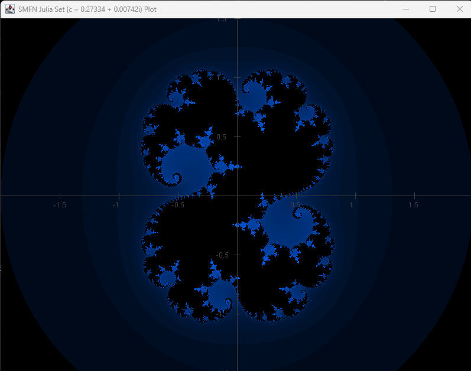

# Part 7: Graphics Subsystem
The graphics subsystem of `SMFN-library` provides a decoupled visualization framework designed to bridge abstract mathematical models with graphical rendering. The design enforces a strict separation of concerns: mathematical models hold no knowledge of pixels or UI components, and rendering engines hold no knowledge of math.



## Architecture & Decoupling Philosophy
The graphics layer operates across three decoupled tiers:

$$\text{Mathematical Model } f(D) = C \quad\xrightarrow[\text{domainAdapter / colorMapper}]{\text{Viewport}}\quad \text{Plotter Orchestrator} \quad\xrightarrow[\text{Renderer}]{}\quad \text{Concrete Driver}$$

1. **Mathematical Model ($f: D \to C$):** Pure algebraic structures and functions, completely agnostic of pixels, framebuffers, or rendering tech.
2. **Plotter Orchestrator (`graphics.plotting`):** Middle tier that samples mathematical models across coordinate bounds defined by a `Viewport`, employing domain adapters and color mappers to translate mathematical values into drawing commands.
3. **Concrete Driver (`graphics.drivers`):** Platform-specific rendering implementation (e.g., AWT/Swing) that executes low-level drawing primitives on screen or image buffers.

### Package Structure
```text
net.gommagomma.smfn.graphics
  +-- core        # Rendering abstractions, primitive contracts, and viewport transformations
  +-- drivers.swing # Concrete desktop AWT/Swing driver implementations
  \-- plotting    # Mathematical plotting orchestrators and coordinate adapters
```

* **`graphics.core`**: Hardware-agnostic interfaces and coordinate space transformations.
* **`graphics.drivers.swing`**: Desktop AWT/Swing driver implementations. Interchangeable with alternative drivers (e.g., SVG, JavaFX) without affecting mathematical logic.
* **`graphics.plotting`**: Functional orchestrators bridging generic algebraic elements to drawing primitives.


## Core Infrastructure & Rendering Primitives (`graphics.core`)

### Renderer Contracts and Primitives
The `Renderer` interface defines the low-level API contract required by all plotting orchestrators. It encapsulates frame lifecycle management, state selection, and fundamental drawing primitives across two coordinate regimes:

* **Frame Lifecycle & State Operations:**
  * `startDrawing()`: Initializes a rendering frame.
  * `endDrawingAndFlush()`: Finalizes the frame and flushes drawing commands to the target buffer/screen.
  * `clear()`: Clears the active rendering buffer.
  * `setColor(Color color)`: Sets the active drawing color.

* **Primitives (Viewport-transformed):**
  * `drawPoint(int x, int y)`: Draws a single pixel.
  * `drawLine(int x1, int y1, int x2, int y2)`: Draws a 1D line segment.
  * `drawText(String text, int x, int y)`: Renders textual labels transformed via viewport coordinates.

* **HUD Overlay Primitives (Viewport-independent):**
  * `drawOverlayText(String text, int x, int y)`: Renders screen-fixed Heads-Up Display (HUD) overlays directly in pixel coordinates $[0, w] \times [0, h]$, bypassing viewport transforms (e.g., displaying viewport bounds, mouse inspection coordinates, or solver runtime metrics).

### Renderer Specializations
* **`Renderer1D`**: Specialized for continuous 1D curve sampling and line-based drawing.
* **`Renderer2D`**: Extended interface adding pixel-grid region filling and 2D surface rendering operations.
* **`drivers.swing` (`SwingRenderer1D`, `SwingRenderer2D`)**: Concrete desktop implementations backed by Java AWT/Swing graphics context.

### Coordinate Transformation (`Viewport`)
The `Viewport` encapsulates bidirectional transformations between continuous mathematical space $[x_{\min}, x_{\max}] \times [y_{\min}, y_{\max}]$ and discrete screen pixel space $[0, w] \times [0, h]$:

* `convertMathXToPixelX(double mathX)`, `convertMathYToPixelY(double mathY)`
* `convertPixelXToMathX(int pixelX)`, `convertPixelYToMathY(int pixelY)`

### Interactive Control (`ViewportController`)
`ViewportController` manages interactive input (panning, zooming) and notifies registered `ViewportUpdateHandler` listeners upon bound modifications, keeping input event handling isolated from mathematical models.


## Plotting Layer (`graphics.plotting`)
The plotting package coordinates sampling and mapping between algebraic objects and rendering primitives.

### 1D Function Plotting (`FunctionPlotter1D`)
`FunctionPlotter1D` samples a continuous mapping $f(x)$ across the viewport's horizontal domain and renders the resulting curve.

```java
public static <D extends AlgebraicElement<D>, C extends AlgebraicElement<C>>
void plotFunction(
        Renderer renderer,                     /* Renderer instance */
        Viewport viewport,                     /* Viewport defining coordinate mapping */
        Mapping<D, C> function,                /* Mathematical function f(D) = C */
        Function<Double, D> domainAdapter,     /* Domain adapter from double to D (e.g., Double -> Real) */
        Function<C, Double> codomainAdapter)   /* Codomain adapter from C to double (e.g., Real -> Double) */
```

### 2D Function Plotting (`FunctionPlotter2D`)
`FunctionPlotter2D` evaluates a mathematical mapping $f: D \to C$ across pixel grids. It requires two functional adapters to maintain independence from concrete mathematical types:

1. **`domainAdapter` ($(x, y) \mapsto D$)**: Assembles raw Cartesian coordinates into a domain element $D$ (e.g., combining $x, y \in \mathbb{R}$ into $z \in \mathbb{C}$).
2. **`colorMapper` ($C \mapsto \text{Color}$)**: Converts the output algebraic value $C = f(D)$ into an AWT `Color`.

```java
public static <D extends AlgebraicElement<D>, C extends AlgebraicElement<C>>
void plotFunction(
        Renderer renderer,                            /* Renderer instance */
        Viewport viewport,                            /* Viewport defining coordinate mapping */
        Mapping<D, C> function,                       /* Mathematical function f(D) = C */
        BiFunction<Double, Double, D> domainAdapter,  /* Domain adapter combining math X and Y into element D */
        ColorMapper<C> colorMapper)                   /* Color mapper transforming output C into AWT Color */
```

This pipeline enables the visualization of scalar fields, complex functions, fractals (Mandelbrot/Julia sets), and heatmaps.

### Discrete Data & Geometric Rendering (`ScatterPlotter`)
`ScatterPlotter` renders discrete collections of mathematical `Point` objects. It is used for:
* Trajectories and state histories generated by ODE solvers or physical simulators.
* Discrete point clouds and data distributions.
* Geometric constructions and implicit shape intersections.

### Axis & Grid Overlays (`CartesianAxisPlotter`)
`CartesianAxisPlotter` renders mathematical coordinate axes, dynamic tick marks, and domain grid lines over an active plot. Unlike screen-space HUD overlays, these visual structures are bound to the `Viewport` transform and dynamically rescale during pan and zoom operations.