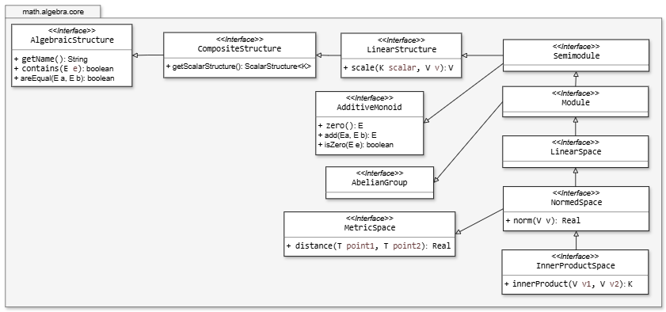
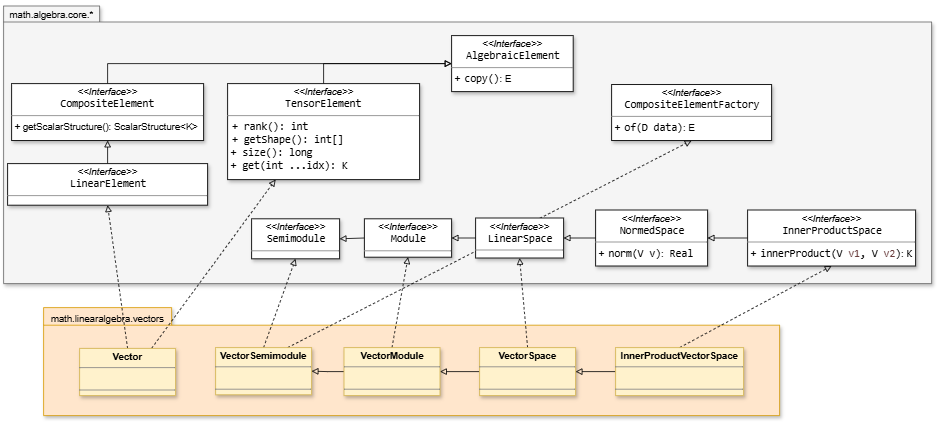
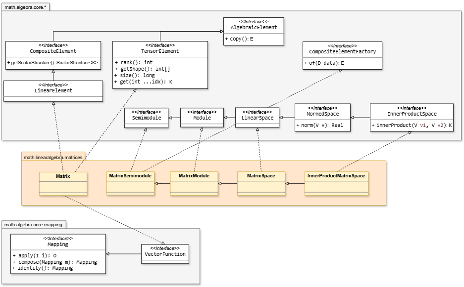
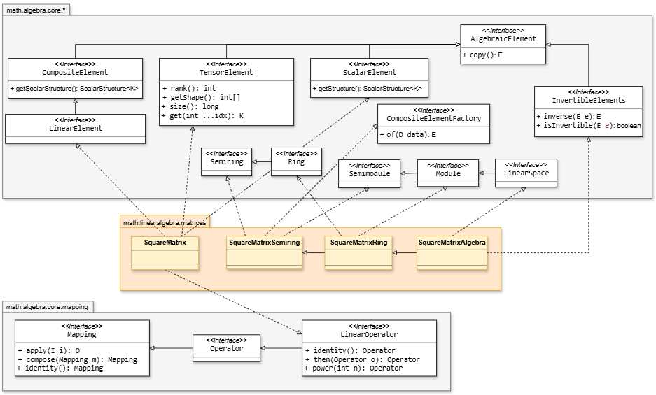

# Linear Algebra

## Spaces
The structures governing vectors and matrices directly mirror the axiomatic hierarchy of algebraic modules and metric spaces:



| Space Structure | Requirements on $K$ / Domain | Key Operations Unlocked |
| :--- | :--- | :--- |
| **`Semimodule`** | $K \in \text{Semiring}$ | Vector addition (`add`), positive scalar scaling (`scale`), zero vector (`zero`). |
| **`Module`** | $K \in \text{Ring}$ | Additive inverse (`negate`), vector subtraction (`subtract`). |
| **`LinearSpace`** | $K \in \text{Field}$ | Scalar division, basis generation, dimension determination, general linear combinations. |
| **`NormedSpace`** | $K \in \text{Field}$ + Norm | Vector magnitude/length computation ($\Vert{}v\Vert{}$, `norm()`), distance calculations. |
| **`InnerProductSpace`** | $K \in \text{Field}$ + Inner Product | Dot/Hermitian product (`innerProduct()`), orthogonality checks, vector projections. |


## Vectors
`Vector<K>` is an immutable, fixed-size sequence of `K` elements. As pure numerical elements, all domain operations reside within a governing structure (`VectorSpace` or its sub-interfaces) tailored to a specific dimension.

```java
RealField R = RealField.INSTANCE;
VectorSpace<Real, RealField> V3 = new VectorSpace<>(R, 3);

Vector<Real> v = V3.of(new Real[]{ R.of(1.0), R.of(2.0), R.of(3.0) });
Vector<Real> w = V3.of(new Real[]{ R.of(4.0), R.of(-1.0), R.of(2.0) });

Vector<Real> sum = V3.add(v, w);          // (5.0, 1.0, 5.0)
Vector<Real> scaled = V3.scale(R.of(2.0), v); // (2.0, 4.0, 6.0)
```



The operational capabilities of vector structures scale dynamically with the algebraic strength guaranteed by the underlying scalar type  `K`:

| Structure | Requires `K` to be | Adds |
|---|---|---|
| `VectorSemimodule<K,S>` | `Semiring` | `add`, `scale`, `zero()` |
| `VectorModule<K,S>` | `Ring` | `negate`, `subtract` |
| `VectorSpace<K,S>` | `Field` | Division by scalar (inherited via field operations on `K`) |
| `InnerProductVectorSpace<K,S>` | `Field` | `innerProduct`, `norm` |

```java
InnerProductVectorSpace<Complex, ComplexField> S = new InnerProductVectorSpace<>(ComplexField.INSTANCE, 2);
Complex dot = S.innerProduct(a, b);   // Physics convention: conjugates the first argument <a, b>
Real length = S.norm(a);
```


## Matrices
`Matrix<K>` represents the general rectangular case ($m \times n$). Rectangular matrices follow the same structural ladder (`MatrixSemimodule → MatrixModule → MatrixSpace → InnerProductMatrixSpace`):

```java
MatrixSpace<Real, RealField> M23 = new MatrixSpace<>(R, 2, 3);
Matrix<Real> A = M23.of(new Real[]{
    R.of(1), R.of(0), R.of(2),
    R.of(0), R.of(1), R.of(-1)
});

Matrix<Real> At = M23.transpose(A);   // 3x2, from MatrixSemimodule (available at every level)
int rank = M23.rank(A);               // Row-echelon reduction (requires K to be a Field)
```




Like vectors, the operational capabilities of matrices structures scale dynamically with the algebraic strength guaranteed by the underlying scalar type  `K`:

| Structure | Requires `K` to be | Adds |
|---|---|---|
| `SquareMatrixSemiring<K,S>` | `Semiring` | `add`, `multiply`, `transpose`, `one()` (identity) |
| `SquareMatrixRing<K,S>` | `Ring` | `negate`, `subtract`, `determinant` (via exact Laplace cofactor expansion) |
| `SquareMatrixAlgebra<K,S>` | `Field` | `InvertibleElements` (`isInvertible`, `inverse`), a faster `determinant` (via Gaussian elimination, used above dimension 3) |

**Exact vs. Fast Determinants**: `SquareMatrixRing` computes determinants over any commutative ring (such as `SignedInt`, `Polynomial<Rational>`, or nested matrices) using Laplace cofactor expansion because it relies solely on addition, multiplication, and negation. Conversely, `SquareMatrixAlgebra` utilizes Gaussian elimination for high-performance calculations, which requires scalar division and is therefore restricted to fields. $M_{n \times n}(K)$ does not form a field: matrix multiplication is non-commutative ($A \cdot B \neq B \cdot A$), and non-zero singular matrices lack a multiplicative inverse. Therefore, `SquareMatrixAlgebra` implements `InvertibleElements`, enforcing dynamic, per-matrix invertibility checks:

```java
SquareMatrixAlgebra<Complex, ComplexField> M2 = new SquareMatrixAlgebra<>(ComplexField.INSTANCE, 2);
M2.isInvertible(matrix);   // Evaluates determinant vs tolerance; returns false for singular matrices
M2.inverse(matrix);        // Throws ArithmeticException if singular, preventing NaN propagation
```

`Matrix<K>` implements `VectorFunction<K>` (which is a specialized `Mapping<Vector<K>, Vector<K>>`). This allows any matrix to act directly as a vector transformation via matrix-vector multiplication:

```java
Vector<Real> x = V3.of(new Real[]{ R.of(1), R.of(1), R.of(1) });
Vector<Real> result = A.apply(x);   // A*x, a 2-dimensional vector
```

\**Note: Rectangular matrices do not implement Operator. An Operator guarantees a mapping within the same domain space ($T \to T$), whereas a rectangular matrix ($m \times n$) fundamentally alters the spatial dimension between domain and codomain.*

## Square Matrices
`SquareMatrix<K>` restricts the dimensions to $n \times n$, unlocking properties and capabilities unique to equal-dimension transformations.

`SquareMatrix<K>` implements `ScalarElement<SquareMatrix<K>>`, the same algebraic interface implemented by `Real`, `Complex`, and `Polynomial<K>`. This design enables powerful recursive algebraic compositions:

* `Polynomial<SquareMatrix<K>>`: Evaluates matrix polynomials and characteristic equations.
* `SquareMatrix<Polynomial<K>>`: Enables polynomial matrices used in linear system control theory.

Because the domain and codomain share identical dimensions, `SquareMatrix<K>` implements `LinearOperator<Vector<K>>`. Operations such as function application, operator composition, and matrix exponentiation are inherited directly from Mapping/Operator:

```java
SquareMatrix<Real> rotate90 = SquareMatrixElementFactory.of(R, R.of(0), R.of(-1), R.of(1), R.of(0));

Vector<Real> once  = rotate90.apply(point);                    // Single 90-degree turn
Vector<Real> twice = rotate90.compose(rotate90).apply(point);  // Equivalent to (rotate90 * rotate90).apply(point)
Vector<Real> back   = rotate90.power(4).apply(point);          // Four full rotations (identity operation)
```


In addition to basic matrix algebra, `SquareMatrix<K>` exposes built-in predicates to evaluate fundamental geometric and structural invariants:

```java
matrix.conjugateTranspose();   // Returns identity transpose for Real, conjugate transpose for Complex (A†)
matrix.isSymmetric();          // Checks if A == A^T (real symmetry)
matrix.isHermitian();          // Checks if A == A† (self-adjoint / complex symmetry)
matrix.isUnitary();            // Checks if A * A† == I (preserves norm and inner products)
```
